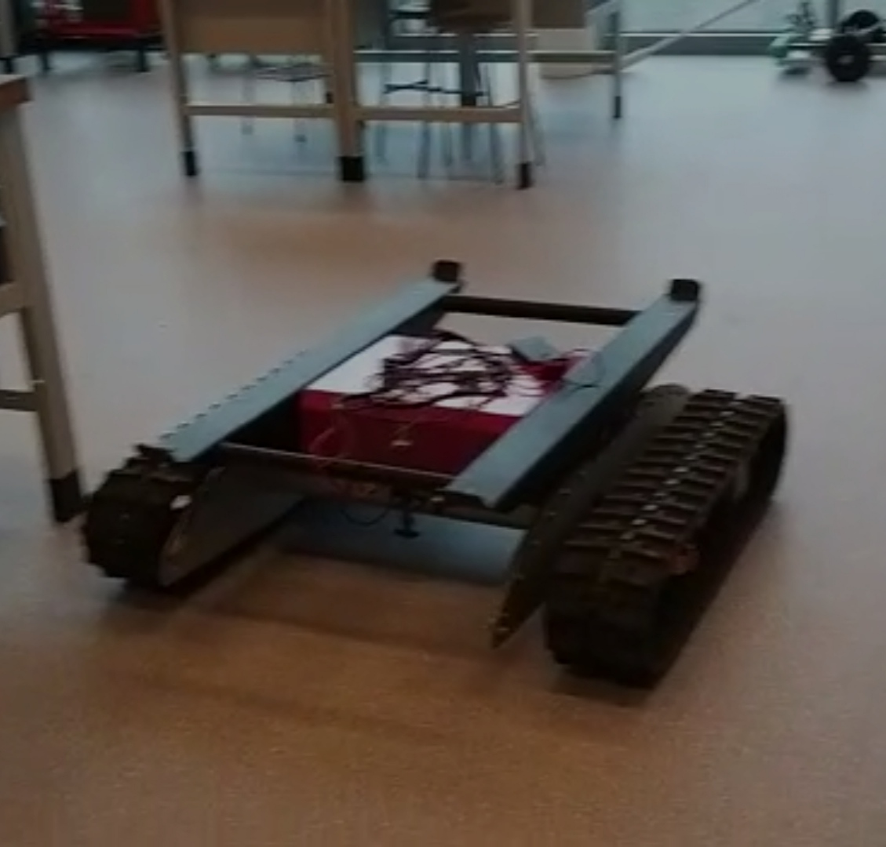
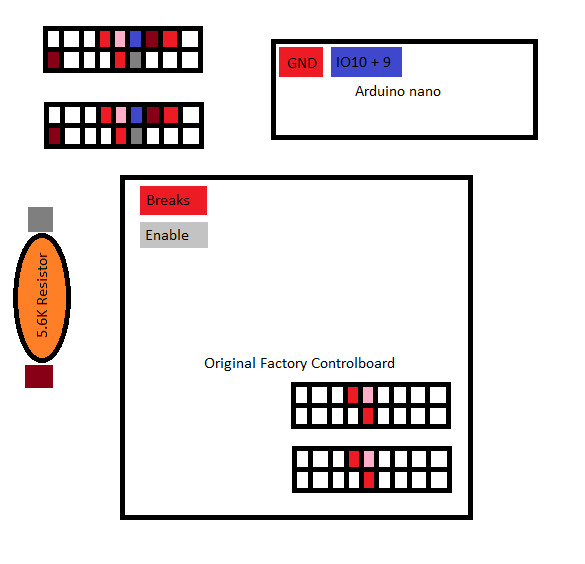

# DEPRECATED! DO NOT USE. Replaced by [araf-esp32-undercarriage](https://github.com/Autonomous-Argo-Systems/araf-esp32-undercarriage)
## araf-arduino-onderstel

This code is a rosnode that is made to interface with ros to control the neorover.

## purpose
This is the first EXPERIMENTAL setup of the neorover to control it with ros. 
It uses a lot of wires and is a bit messy but works most of the time. 
It is experimental for a reason so do not use it on the new boards.

## setup

## flash
It is recommended to use the platformio extension for VS-Code to build an compile the code for an arduino nano.\
Please follow this tutorial: [Install PlatformIO Guide](https://platformio.org/install)
